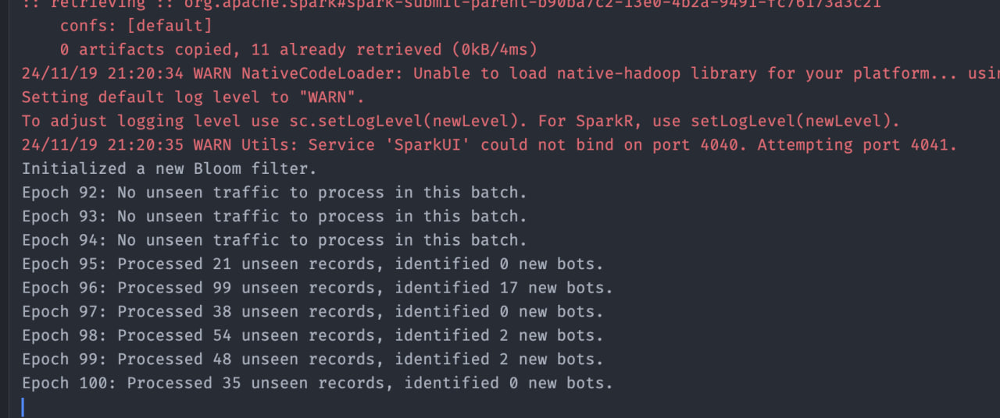

### Step 1: Run Real-Time Wikipedia Edit Streamer with TCP Socket Output


```commandline
python hw2/socket_server/stream.py 20241025
```

### Step 2: Sample data using Spark Streaming and save it to csv files

```commandline
cd hw2/socket_server/ 
python sample_stream.py
```

### Step 3: Make EDA and Modelling to train model
[Look at this notebook for details](Bloom%20FIlter%20and%20EDA.ipynb)

### Step 4: Implement Online Inference pipeline using Spark streaming
```commandline
# to run kafka
cd hw2/
docker-compose up
# run producer
python hw2/kafka_stream.py
# run spark streaming
python hw2/online_inference
``` 



In scope of our submission, we have implemented two different approaches for streaming the data. 

-

### Step 1: Run Real-Time Wikipedia Edit Streamer with TCP Socket Output 
We gather the data from wiki event stream, and then redirect the data to the socket. 

```commandline
python hw2/socket_server/stream.py 20241025
```

### Step 2: Sample data using Spark Streaming and save it to csv files
Secondly, we sample the redirected stream using Spark Streaming, and then we save the data into csv format.
```commandline
cd hw2/socket_server/ 
python hw2/socket_server/sample_stream.py
```

### Step 3: Make EDA and Modelling to train model
We perform data analysis with plots and then train the model and bloom filter on top of it's result, serializing the params in the end.
[Look at this notebook for details](Bloom%20FIlter%20and%20EDA.ipynb)

### Step 4: Implement Online Inference pipeline using Spark streaming
Then we deploy Kafka using docker compose and connect to the wiki stream once again to redirect the data using the topics this time.
We deserialize the models and run the online stream inference per record for demo purposes.
```commandline
cd hw2/
docker-compose up          # Run Kafka  
```
```commandline
python hw2/kafka_stream.py     # Start producer
```
```commandline
python hw2/online_inference.py # Start Spark Streaming  
```

### Summary
We implemented a scalable pipeline to filter out bots from Wikipedia Edits stream. 

We used BloomFilter to filter out 90% of edits and our model to find bots and add them to the black list. 
As we can see, with each run our black list becomes larger, as well as our ability to detect bots.